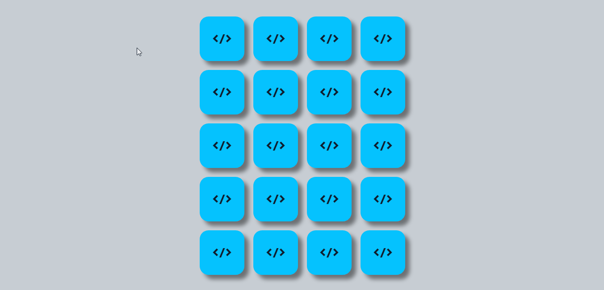

<h1 align="center">
Matching Game - Coding Theme
</h1>

 

  
This application was developed in Javascript together with HTML and CSS. This is a Matching Game, that require players to match similar elements. 
  Participants need to find a match for the card.

  

  
  
  ### Desktop Version
  

  
  

## Technologies

This project was developed with the technologies and tools below:

- ➡️ HTML

- ➡️ CSS

- ➡️ Javascript

Made with 💙 by riandk1 :globe_with_meridians: [Conect!](https://www.linkedin.com/in/riadnk1/) 
 
## You can also test [here!](https://riandk1.github.io/matching-game/)
